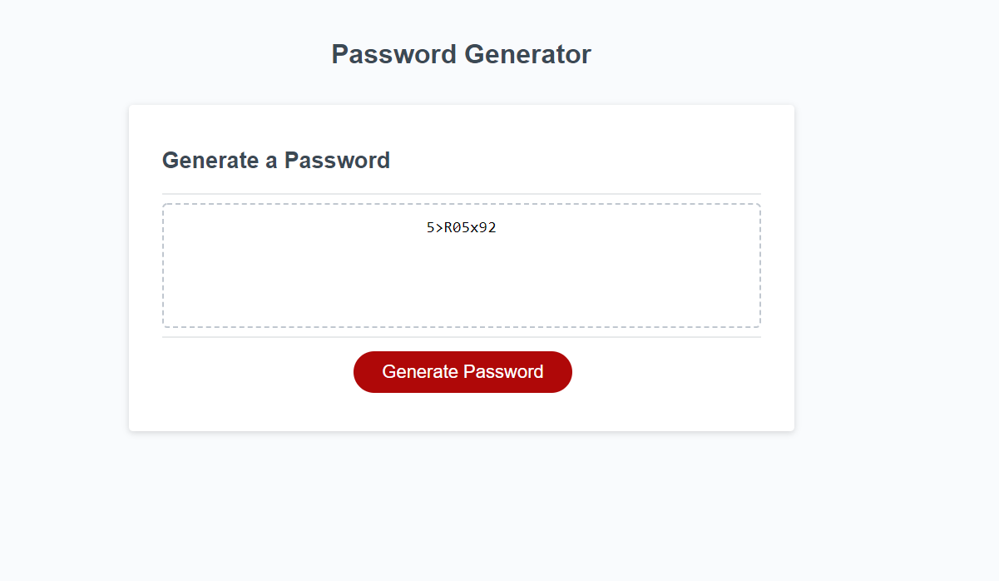

# JavaScript Password Generator

## Table of Contents

* [Description](#description)
* [Usage](#usage)
* [Credits](#credits)
* [License](#license)
* [Instructions](#instructions)

## Description

If you've ever needed a secure password that fits your specific specifications, then you've come to the right place! You can choose the length of your password (between 8 and 128 characters, of course), and if you would like to have uppercase letters, lowercase letters, numbers, and special characters within your password. The password will be randomly generated and copied directly to your clipboard for ease of use to allow you to paste it into your desired login page. It also displays on the webpage if you need to copy it again in the future. Password security is very important these days, so make sure to generate your new password today! 

This application is written in JavaScript with HTML and CSS. 

## Usage



Navigate to [Sarah Makela's Portfolio](https://smakela13.github.io/js-password-generator/index.html) and view the web page.

## Credits

Created by [Sarah Makela](github.com/smakela13).

## License

This website currently has No License, which means it is under exclusive copyright. No one can copy, distribute, or modify this website without permission.

---

## 03 JavaScript: Password Generator

### Your Task

This week’s homework requires you to modify starter code to create an application that enables employees to generate random passwords based on criteria that they’ve selected. This app will run in the browser and will feature dynamically updated HTML and CSS powered by JavaScript code that you write. It will have a clean and polished, responsive user interface that adapts to multiple screen sizes.

The password can include special characters. If you’re unfamiliar with these, see this [list of password special characters](https://www.owasp.org/index.php/Password_special_characters) from the OWASP Foundation.

### User Story

```
AS AN employee with access to sensitive data
I WANT to randomly generate a password that meets certain criteria
SO THAT I can create a strong password that provides greater security
```

### Acceptance Criteria

```
GIVEN I need a new, secure password 
WHEN I click the button to generate a password
THEN I am presented with a series of prompts for password criteria y
WHEN prompted for password criteria
THEN I select which criteria to include in the password y
WHEN prompted for the length of the password
THEN I choose a length of at least 8 characters and no more than 128 characters y
WHEN prompted for character types to include in the password
THEN I choose lowercase, uppercase, numeric, and/or special characters y
WHEN I answer each prompt
THEN my input should be validated and at least one character type should be selected y
WHEN all prompts are answered
THEN a password is generated that matches the selected criteria y
WHEN the password is generated
THEN the password is either displayed in an alert or written to the page y
```

### Mock-Up

The following image shows the web application's appearance and functionality:


### Grading Requirements

This homework is graded based on the following criteria: 

### Technical Acceptance Criteria: 40%

* Satisfies all of the preceding acceptance criteria plus the following:

  * The homework should not produce any errors in the console when you inspect it using Chrome DevTools.

### Deployment: 32%

* Application deployed at live URL.

* Application loads with no errors.

* Application GitHub URL submitted.

* GitHub repository that contains application code.

### Application Quality: 15%

* Application user experience is intuitive and easy to navigate.

* Application user interface style is clean and polished.

* Application resembles the mock-up functionality provided in the homework instructions.

### Repository Quality: 13%

* Repository has a unique name.

* Repository follows best practices for file structure and naming conventions.

* Repository follows best practices for class/id naming conventions, indentation, quality comments, etc.

* Repository contains multiple descriptive commit messages.

* Repository contains quality readme file with description, screenshot, and link to deployed application.

## Review

You are required to submit the following for review:

* The URL of the deployed application.

* The URL of the GitHub repository, with a unique name and a readme describing the project.

- - -
© 2021 Trilogy Education Services, LLC, a 2U, Inc. brand. Confidential and Proprietary. All Rights Reserved.
